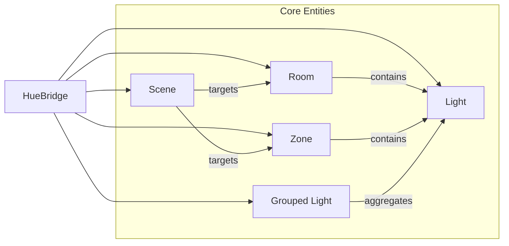

# Hueify

Hueify is an async-first Python library for Philips Hue. It provides clean, focused entity classes (`Light`, `Room`, `Zone`, `Scene`) that match the Hue app and lets you build automations with minimal code. It also ships with an MCP server for LLM tools and keeps state fresh via server‑sent events.

```bash
pip install hueify
```

---

## What You Can Build

- Turn lights on/off, set brightness and color temperature.
- Control rooms and zones the same way you do in the Hue app.
- Activate scenes for rooms or zones.
- Run long-lived processes that stay up-to-date without polling.

Hueify includes a ready-to-use MCP server (`mcp_server`) so you can expose these controls to compatible LLM tools.

### Hue domain model

Hueify mirrors the structure of the Hue app:



Each entity type has:

- A strongly-typed model (e.g. `LightInfo`, `SceneInfo`).
- Async methods to read and change state.
- Clear domain exceptions when a name isn’t found.

---

## Lights by name

Control a single light using the same name you see in the Hue app. If a name is not found, a `LightNotFoundException` is raised with similar name suggestions.

```python
import asyncio
from hueify import Light


async def main() -> None:
    light = await Light.from_name("Living room lamp")

    await light.turn_on()
    await light.set_brightness_percentage(75)
    await light.set_color_temperature_percentage(30)
    current = light.brightness_percentage
    print("Brightness:", current)


if __name__ == "__main__":
    asyncio.run(main())
```

---

## Rooms

Rooms group lights like in the Hue app. Use `from_name` to target by display name. Missing rooms raise `RoomNotFoundException` with suggestions.

```python
import asyncio
from hueify import Room


async def main() -> None:
    room = await Room.from_name("Living Room")

    await room.turn_on()
    await room.set_brightness_percentage(40)
    await room.increase_brightness_percentage(20)
    await room.set_color_temperature_percentage(35)

    await room.activate_scene("Relax")
    active = await room.get_active_scene()
    print("Active scene:", active.name if active else None)

if __name__ == "__main__":
    asyncio.run(main())
```


---

## Zones

Zones are cross-room groupings. Same control surface as rooms. Missing zones raise `ZoneNotFoundException` with suggestions.

```python
import asyncio
from hueify import Zone, ZoneNotFoundException


async def main() -> None:
    zone = await Zone.from_name("Downstairs")

    await zone.turn_on()
    await zone.set_brightness_percentage(60)
    await zone.decrease_brightness_percentage(10)
    await zone.activate_scene("Focus")

    active = await zone.get_active_scene()
    print("Active scene:", active.name if active else None)

if __name__ == "__main__":
    asyncio.run(main())
```

---

## Caching and live sync

Hueify maintains an internal cache and listens to the Hue bridge’s server‑sent events. Changes from outside your script (e.g. the Hue app) are applied automatically to instantiated objects and cached data, enabling fast responses and reliable state without polling.

Optionally warm the cache up-front for the lowest latency:

```python
import asyncio
from hueify import get_cache


async def main() -> None:
    cache = get_cache()
    await cache.populate()


if __name__ == "__main__":
    asyncio.run(main())
```

---

## MCP server

Hueify includes a ready-to-use Model Context Protocol (MCP) server so you can control your Hue setup from compatible LLM tools. It exposes the same operations shown above (`turn_on`, `set_brightness_percentage`, `activate_scene`, etc.).

- The server uses the same entity abstractions (`Light`, `Room`, `Zone`, `Scene`) and the shared cache.
- Integration depends on your MCP host and is intentionally not covered here.


---

## License

[MIT](LICENSE)
